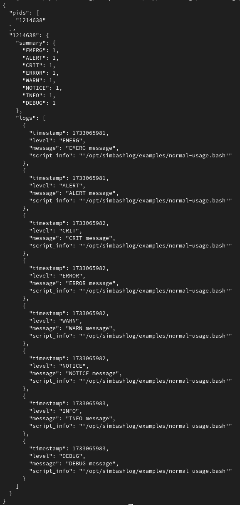

# `simbashlog`: Simply log (and debug) your scripts/programs with Bash

<p align="center">
  <a href="./LICENSE">
    
  </a>
</p>

<div align="center">
  <table>
    <tr>
      <td>
        <a href="https://github.com/fuchs-fabian/simbashlog">
          
        </a>
      </td>
    </tr>
  </table>
</div>

<p align="center">
  <a href="https://github.com/fuchs-fabian/simbashlog/blob/main/examples/normal-usage.bash">
    
  </a>
  <a href="https://github.com/fuchs-fabian/simbashlog/blob/main/examples/advanced-usage.bash">
    
  </a>
</p>

## ⚠️ **Disclaimer - Important!**

> `simbashlog` is still at a very early stage of development.\
> There may still be bugs that have not been accounted.

When it is used in production, it is important that it is tested on a test system to ensure that there are no problems and that it behaves as desired.

In general, it is important that the script is checked so that it can be understood what it does and how it works.

No liability is accepted for damage of any kind resulting from the use of `simbashlog`.

For more information, please read the [LICENSE](./LICENSE).

### Tested Linux Distributions

| Number | Status | Platform                                       |
|--------|--------|------------------------------------------------|
| 1      | ✅     | [Fedora](https://fedoraproject.org/en/)        |
| 2      | ✅     | [Ubuntu](https://ubuntu.com/download)          |
| 3      | ✅     | [Debian](https://www.debian.org/index.en.html) |

It may also work on other systems, but it has not been tested.

## Description

### What is `simbashlog`?

`simbashlog` is a simple and easy-to-use logging tool for Bash environments. It is designed to make logging and debugging in Bash scripts and Linux environments which uses Bash as easy as possible.

It can be sourced in Bash scripts or called as a standalone script with arguments so that it can be used with other scripts or programs.

`simbashlog` may be the first Bash script to include functions that mimic functions of data types found in other programming languages.

This means that when the script is sourced, it contains functions that make it much easier to create your own Bash scripts.

Ultimately, `simbashlog` takes the work out of logging and debugging Bash scripts so that the developer can concentrate on the actual script.

By default, everything is set so that you can get started straight away without any major configurations.
Nevertheless, the behavior is highly customizable so that it can be used for many different use cases.

### Why `simbashlog`?

Logging and debugging in Bash scripts or other programming languages can often be a tedious and complicated task. Integrating a logging tool into your code can be just as challenging, especially when it comes to sensitive data such as login credentials. Many developers unintentionally embed such information directly into their code, leading to potential security issues. While tools like Secret Manager exist, they can be overly complex for beginners and even cumbersome for experienced developers.

This is where `simbashlog` comes in. It is designed to simplify logging in Bash scripts and other programming languages (_**note**: console arguments must be possible_), making it easy to use without compromising security. There is no need to hard-code credentials or sensitive information. Instead, you can configure a separate notifier to handle alerts, with all credentials stored securely outside the codebase so they don't end up in your repository.

With `simbashlog`, your logs follow a consistent structure, making them easy to process and analyze. Whether you are a beginner or an expert, this tool offers a seamless log management solution, providing flexibility and security.

### What makes it special?

Quite simply, it's super easy to use, very flexible and the credentials are no longer stored in the code.
This makes it very easy to create a script or program that logs all the necessary information. And if you want, you can also be notified about it.

The "only" basic requirement is that the script or tool runs on a Linux system and Bash is installed.
Why "only" in quotation marks? Because it could also run on other untested systems, but this has not yet been tested. Problems may arise with certain commands such as `date` or `logger`.

#### Notifier

A notifier is ultimately a script/tool or interface that ensures that various monitoring tools receive information or log information is transmitted to a messenger.

Possible examples of "monitoring tools":

- [Checkmk](https://checkmk.com/)
- [Nagios](https://www.nagios.org/)
- [Icinga](https://icinga.com/)
- [Uptime Kuma](https://uptime.kuma.pet/)
- [Graylog](https://graylog.org/)

Possible examples of "messengers":

- E-Mail
- [Pushover](https://pushover.net/)
- [Gotify](https://gotify.net/)
- [Matrix](https://matrix.org/)
- [Slack](https://slack.com/)
- [Discord](https://discord.com/)
- [Telegram](https://web.telegram.org/)

A notifier can also be misused to write log information to a database or generally to pre-process the logged data again.

Notifiers can be found in a separate repository:

<div align="left">
  <table>
    <tr>
      <td>
        <a href="https://github.com/fuchs-fabian/simbashlog-notifiers">
          
        </a>
      </td>
    </tr>
  </table>
</div>

### What is it not?

`simbashlog` is not a replacement for the monitoring tools or messengers mentioned above!

It merely makes it possible to feed these tools with information.

### Who is it for?

`simbashlog` is suitable for beginners, advanced users and professionals.
It is therefore suitable for small, medium and large companies.

It does not matter if `simbashlog` is used on a Linux server, a desktop Linux system, Docker...

### The Goal of `simbashlog`

The goal of `simbashlog` is to make logging and debugging on Linux environments as easy as possible.

The basic idea is that open source software should be accessible to everyone and there should be no barriers to using it.
Since there is no tool that makes logging as easy as it should be (_in my opinion_), `simbashlog` was developed.

There should be no fixed connection in the code, but it should simply be possible to configure the way where the log information goes without having to do anything in the code.

## Getting Started

Clone `simbashlog` with HTTPS:

```bash
git clone https://github.com/fuchs-fabian/simbashlog.git
```

Or clone `simbashlog` with HTTPS and submodules:

```bash
git clone --recurse-submodules https://github.com/fuchs-fabian/simbashlog.git
```

> **Notes**:
>
> - `</path/to>` is the path to the directory where the repository was cloned and should be replaced with the actual path.
> - `sudo` is only necessary if it exists on the system and the script should be called from anywhere.

Make the script executable:

```bash
chmod +x </path/to>/simbashlog/src/simbashlog.bash
```

Run the following command so that the script can be called from anywhere:

```bash
sudo ln -s </path/to>/simbashlog/src/simbashlog.bash /bin/simbashlog
```

> **Note**: Do not use a relative path here, as this will break the symbolic link.

This will create a symbolic link to the script in the `/bin` directory.

To check whether it worked:

```bash
ls -l /bin/simbashlog
```

```bash
simbashlog --version
```

To update the script, move to the directory where the repository was cloned and run the following command:

```bash
git pull --rebase
```

> ⚠️ **Important**:\
> Do not delete the repository, as this will also break the symbolic link.\
> If it was intended, the symbolic link must be deleted: `sudo rm /bin/simbashlog`

### Submodule

If you want to use `simbashlog` as a submodule in your repository, you can do this as follows:

```bash
git submodule add https://github.com/fuchs-fabian/simbashlog.git src/simbashlog
```

```bash
git add .
```

```bash
git commit -m "Add simbashlog as submodule"
```

```bash
git push
```

Clone your repository with `simbashlog` as submodule:

```bash
git clone --recurse-submodules https://github.com/<repo>.git
```

Replace `<repo>` with the actual repository name.

If you normally clone the repository, the submodule will not be cloned, so you have to do it manually:

Initialize and update the submodule:

```bash
git submodule update --init --recursive
```

This will add the contents of the `simbashlog` repository to your repository.

## Usage

### Usage with `source`

The easiest way to use `simbashlog` is to take a look at the examples in the [`examples`](./examples/) directory.

### Usage with calling the script directly with arguments

```plain
Usage: (sudo) simbashlog

  -h, --help                                      Show help

  -v, --version                                   Show version

  -a, --action            [action]                Action for logging
                                                  {console,log,json,system,all}
                                                  Important: Json logging can lead to performance problems
                                                  Note: There will always be an output on the console
                                                  Addition for 'system': If '--script-name' was used, this is the tag that can be searched for.
                                                                         Otherwise the absolute path of 'simbashlog' is used.

  -s, --severity          [severity]              Severity for logging
                                                  {
                                                      debug,  7,
                                                      info,   6,
                                                      notice, 5,
                                                      warn,   4,
                                                      error,  3,
                                                      crit,   2,
                                                      alert,  1,
                                                      emerg,  0
                                                  }

  -m, --message           [message]               Message to be logged

  --notifier              [notifier]              'simbashlog' notifier (https://github.com/fuchs-fabian/simbashlog-notifiers)
                                                  Important: The notifier must be correctly installed

  --notifier-config       [notifier config]       'simbashlog' notifier configuration path
                                                  Important: The path will be passed to the notifier
                                                  Note: '--notifier' should be used before this, otherwise it has no effect
                                                  Default: The default configuration file of the notifier

  --enable-date-in-console-output                 Enable date in console output

  --log-level             [log level]             Log level
                                                  {0,1,2,3,4,5,6,7}
                                                  Note: '-a, --action' should be used before and set to 'console' 'log', 'json' or 'all', otherwise it has no effect
                                                  Default: '6'

  --system-log-level      [system log level]      Log level for system logging
                                                  {0,1,2,3,4,5,6,7}
                                                  Note: '-a, --action' should be used before this and set to 'system' or 'all', otherwise it has no effect
                                                  Default: '4'

  --facility              [facility]              Facility name for system logging
                                                  'logger' facility names ('man logger'):
                                                  {
                                                      auth,authpriv,cron,
                                                      daemon,ftp,kern,
                                                      lpr,mail,news,syslog,user,uucp,
                                                      local0,local1,local2,local3,local4,local5,local6,local7,
                                                      security
                                                  }
                                                  Note: '-a, --action' should be used before this and set to 'system' or 'all', otherwise it has no effect
                                                  Default: 'user'

  --script-name           [script name]           Script name

  --enable-script-name-in-console-output          Enable script name in console output
                                                  Note: '--script-name' should be used before this, otherwise it has no effect

  --log-dir               [log dir]               Directory path for log files
                                                  Important: Be careful! If '--show-log-files' is not used, there is no output where exactly the log files are located
                                                  Note: '-a, --action' should be used before this and set to 'log', 'json' or 'all', otherwise it has no effect
                                                  Default: '/tmp/simbashlogs/'

  --show-log-files                                Show log files after each log operation
                                                  Note: '-a, --action' should be used before this and set to 'log', 'json' or 'all', otherwise it has no effect

  --disable-simple-log-dir-structure              Disable simple log dir structure
                                                  Note: '-a, --action' should be used before this and set to 'log', 'json' or 'all', otherwise it has no effect

  --enable-combined-log-files                     Enable combined log files
                                                  Note: '-a, --action' should be used before this and set to 'log', 'json' or 'all', otherwise it has no effect

  --gui                                           Enable GUI popups for logging notifications with 'zenity' or 'yad'

  --popup-width           [popup width]           Popup window width
                                                  Note: '--gui' should be used before this, otherwise it has no effect
                                                  Default: '500'

  --popup-height          [popup height]          Popup window height
                                                  Note: '--gui' should be used before this, otherwise it has no effect
                                                  Default: '100'
```

## Examples

### Console output


### System log content


### `.log` file


### `.json` log file



## More information for constants, variables and functions

> Constants, variables and functions with a `_` should not be overwritten under any circumstances!

| Color | Category  | Description                 |
|-------|-----------|-----------------------------|
| 🟩    | Beginner  | Suitable for beginners      |
| 🟨    | Advanced  | Suitable for advanced users |
| 🟪    | Expert    | Suitable for experts        |

### Constants

#### 🟩 General constants

| Constant                                          |
|---------------------------------------------------|
| `CONST_CURRENT_PID`                               |
| `CONST_SCRIPT_NAME_WITH_CURRENT_PATH`             |
| `CONST_SIMPLE_SCRIPT_NAME`                        |
| `CONST_SIMPLE_SCRIPT_NAME_WITHOUT_FILE_EXTENSION` |
| `CONST_ABSOLUTE_SCRIPT_NAME`                      |
| `CONST_ABSOLUTE_SCRIPT_DIR`                       |

#### 🟨 `simbashlog` constants

| Constant                                                      |
|---------------------------------------------------------------|
| `CONST_SIMBASHLOG_VERSION`                                    |
| `CONST_SIMBASHLOG_NAME`                                       |
| `CONST_SIMBASHLOG_GITHUB_LINK`                                |
| `CONST_SIMBASHLOG_PAYPAL_DONATE_LINK`                         |
| `CONST_SIMBASHLOG_NOTIFIERS_GITHUB_LINK`                      |
| `CONST_SIMBASHLOG_LOG_DIR`                                    |
| `CONST_SIMBASHLOG_REQUIRED_EXTERNAL_PACKAGE_FOR_JSON_LOGGING` |

#### 🟪 Additional constants

| Constant                                                   |
|------------------------------------------------------------|
| `CONST_ANSI_COLORS`                                        |
| `CONST_COLOR_CODE_FOR_RESETTING_FOREGROUND_AND_BACKGROUND` |
| `CONST_MIN_ALLOWED_SEVERITY_CODE`                          |
| `CONST_MAX_ALLOWED_SEVERITY_CODE`                          |
| `CONST_SEVERITIES`                                         |

### Variables

#### 🟨 Before sourcing

| Variable                | Type    | Possible Values | Default Value |
|-------------------------|---------|-----------------|---------------|
| `ENABLE_TRAP_FOR_DEBUG` | Boolean | `true`, `false` | `false`       |
| `ENABLE_TRAP_FOR_EXIT`  | Boolean | `true`, `false` | `true`        |

#### 🟩 Before and after sourcing

| Variable                                                   | Type    | Possible Values                                               | Default Value               |
|------------------------------------------------------------|---------|---------------------------------------------------------------|-----------------------------|
| `ENABLE_LOG_FILE`                                          | Boolean | `true`, `false`                                               | `true`                      |
| `ENABLE_JSON_LOG_FILE`                                     | Boolean | `true`, `false`                                               | `false`                     |
| `ENABLE_LOG_TO_SYSTEM`                                     | Boolean | `true`, `false`                                               | `false`                     |
| `LOG_DIR`                                                  | String  | Path to the log directory                                     | `$CONST_SIMBASHLOG_LOG_DIR` |
| `ENABLE_SIMPLE_LOG_DIR_STRUCTURE`                          | Boolean | `true`, `false`                                               | `true`                      |
| `ENABLE_COMBINED_LOG_FILES`                                | Boolean | `true`, `false`                                               | `false`                     |
| `LOG_LEVEL`                                                | Integer | `0`, `1`, `2`, `3`, `4`, `5`, `6`, `7`                        | `6`                         |
| `LOG_LEVEL_FOR_SYSTEM_LOGGING`                             | Integer | `0`, `1`, `2`, `3`, `4`, `5`, `6`, `7`                        | `4`                         |
| `FACILITY_NAME_FOR_SYSTEM_LOGGING`                         | String  | `auth`, `authpriv`, `cron`, `daemon`, `ftp`, `kern`, `lpr`, `mail`, `news`, `syslog`, `user`, `uucp`, `local0`, `local1`, `local2`, `local3`, `local4`, `local5`, `local6`, `local7`, `security` | `user` |
| `ENABLE_EXITING_SCRIPT_IF_AT_LEAST_ERROR_IS_LOGGED`        | Boolean | `true`, `false`                                               | `false`                     |
| `ENABLE_DATE_IN_CONSOLE_OUTPUTS_FOR_LOGGING`               | Boolean | `true`, `false`                                               | `false`                     |
| `SHOW_CURRENT_SCRIPT_NAME_IN_CONSOLE_OUTPUTS_FOR_LOGGING`  | String  | `path`, `simple`, `simple_without_file_extension`, `absolute` | `path`                      |
| `PARENT_SCRIPT_NAME`                                       | String  | Path of the parent script (or empty)                          | Empty if the parent script could not be determined |
| `ENABLE_PARENT_SCRIPT_NAME_IN_CONSOLE_OUTPUTS_FOR_LOGGING` | Boolean | `true`, `false`                                               | `false`                     |
| `ENABLE_GUI_POPUPS_FOR_LOGGING_NOTIFICATIONS`              | Boolean | `true`, `false`                                               | `false`                     |
| `LOG_POPUP_NOTIFICATION_WINDOW_WIDTH`                      | Integer | Width in pixels                                               | `500`                       |
| `LOG_POPUP_NOTIFICATION_WINDOW_HEIGHT`                     | Integer | Height in pixels                                              | `100`                       |
| `SIMBASHLOG_NOTIFIER`                                      | String  | Path to the notifier script / notifier command (or empty)     | Empty                       |
| `SIMBASHLOG_NOTIFIER_CONFIG_PATH`                          | String  | Path to the notifier configuration file (or empty)            | Empty                       |
| `ENABLE_SUMMARY_ON_EXIT`                                   | Boolean | `true`, `false`                                               | `false`                     |

### Functions

> For more detailed information on how the following functions can be used, simply take a look at the [source code](./src/simbashlog.bash). They are documented there in detail.

#### 🟩 Logging functions

The easiest way to understand how the functions are used is to see how they are used. Take a look at this:

- [normal-usage.bash](./examples/normal-usage.bash)
- [advanced-usage.bash](./examples/advanced-usage.bash)

```bash
log
log_alert
log_crit
log_debug
log_emerg
log_error
log_info
log_notice
log_warn
```

#### 🟨 Additional functions

Since `simbashlog` has become much more complex than expected, there are some functions that can also be used when the script is sourced.

All the functions that can make life easier with Bash are listed below:

```bash
add_item_to_indexed_array
add_item_to_list
add_key_value_pair_to_assoc_array
add_key_value_pair_to_dict
add_or_update_key_value_pair_in_assoc_array
add_or_update_key_value_pair_in_dict
add_unique_item_to_indexed_array
add_unique_item_to_list
contains_key_in_assoc_array
contains_key_in_dict
contains_not_key_in_assoc_array
contains_not_key_in_dict
delete_key_value_pair_by_key_from_assoc_array
delete_key_value_pair_by_key_from_dict
directory_exists
directory_not_exists
extract_basename_without_file_extensions_from_file
file_exists
file_not_exists
get_available_popup_tool
get_color_code
get_key_by_value_from_assoc_array
get_key_by_value_from_dict
get_severity_code
get_severity_name
get_value_by_key_from_assoc_array
get_value_by_key_from_dict
is_array
is_array_empty
is_array_not_empty
is_assoc_array
is_boolean
is_dict_empty
is_dict_not_empty
is_false
is_greater
is_greater_or_equal
is_indexed_array
is_less
is_less_or_equal
is_list_empty
is_list_not_empty
is_not_boolean
is_not_numeric
is_numeric
is_numeric_and_greater_than_zero
is_numeric_in_range
is_package_installed
is_true
is_var_empty
is_var_equal
is_var_not_empty
is_var_not_equal
normalize_path
path_contains_slash
path_ends_with_slash
path_exists
path_is_absolute
path_is_not_absolute
path_is_not_relative
path_is_relative
path_not_contains_slash
path_not_ends_with_slash
path_not_exists
path_not_starts_with_slash
path_starts_with_slash
print_all_color_combinations
print_all_log_counters
print_all_log_files
print_assoc_array
print_available_functions
print_colored_text
print_dict
print_indexed_array
print_list
print_severities
print_stderr
print_var_with_current_value
to_lowercase
to_uppercase
update_key_value_pair_in_assoc_array
update_key_value_pair_in_dict
write_line_to_file
```

## Bugs, Suggestions, Feedback, and Needed Support

> If you have any bugs, suggestions or feedback, feel free to create an issue or create a pull request with your changes.

This also includes testing the script on other Linux distributions.

## Support Me

If you like `simbashlog`, you think this tool is useful and saves you a lot of work and nerves and lets you sleep better, please give it a star and consider donating.

<a href="https://www.paypal.com/donate/?hosted_button_id=4G9X8TDNYYNKG" target="_blank">
  <!--
    https://github.com/stefan-niedermann/paypal-donate-button
  -->
  
</a>